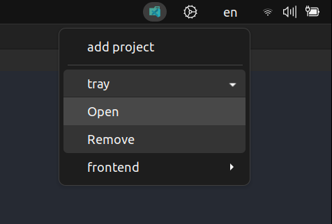

# :computer: OpenInCode 
 <br/>
hey guys, as developers, half of our work involves automating the day to day work processes, after all, we need to stay focused on developing new solutions and not wasting time on things that can easily be automated.
Therefore, I created a software that automates the process of opening the project folders directly in vs code, leaving an icon with the project link in the operating system tray.

## :star: Prerequisites
1. Node (v16.15.0)
2. yarn (because we prefer it, but you can use npm as well)

## :boom: Quick start
in your linux terminal, create a clone of the repository and run the project using the following commands

```cmd
#to clone the repository on your local machine
git clone https://github.com/jimmyginga/open-in-code.git

#to browse the project folder
cd open-in-code

#to install the dependences
yarn

#to start a project
yarn start
```
:zany_face: and enjoy